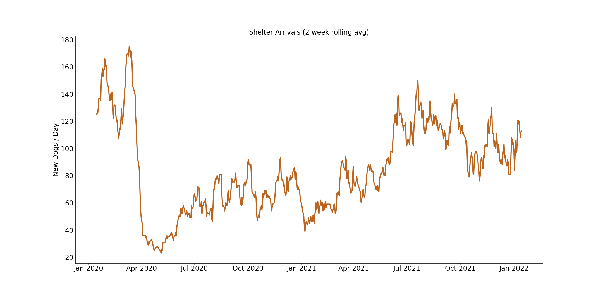

# Good Dogs

### [Launch the Application](https://share.streamlit.io/gwoodstock/gooddogs/main/streamlit/streamlit_app.py)
Find a dog in your area to adopt today!

### [Explore the data](https://public.tableau.com/app/profile/anna.rutledge4407/viz/FindyourDog/Dashboard1) 
Visualize the data on Tableau
 

# Authors
Gene Woodstock, Anna Rutledge, Nate Cox & Elena Yakubchik

General Assembly DSI-1213

 

# Contents:
- Executive Summary
- Problem Statement
- Data
- Models
- Conclusions
- Limitations and next steps

 

# Executive Summary
It came to our attention that many animal shelters are going through a tough time lately. They are experiencing capacity problems and some of them have already reached their space and resources limits, for example Austin Animal Center.
 
This shelter has a no kill policy and for years their main goal has been to find forever homes for all adoptable animals. Austin Animal Center has been accepting and taking care of thousands of animals annually regardless of age, health, species or breed. On Feb 10th Austin Animal Center announced they are nearing capacity and are unable to accept medium and large dogs, and asked the community for help. So our team decided to respond.

Daily Shelter Arrivals

*Interpretation: The massive drop-off in New Dogs/Day in April 2020 coincides with the Shelter In Place (COVID 19) being instituted in March 2020. Many dogs were adopted around this time to keep people company at home. Since then, there has been a steady increase in dogs arriving at shelters and adoption rates have slowed down.*
 
We started with datasets, provided by Austin Animal Center and The Intelligence of Dogs dataset (1994). Our idea was to identify dogs AT RISK to experience extremely long adoption wait times, and help these dogs to be adopted faster. To be able to make predictions we had to clean our data and use a variety of features to find valuable correlations.
 
The next step was modeling. Our project team explored a number of models, looking for the best fit. We ended up using Neural Net, XGBoost and Random Forest models for the best results.
 
While building a model we realized that we can make an App, which can help dogs at risk all over the country to be adopted. So we used Streamlit to create an App that is able to gather up to date data from hundreds of shelters by web scraping Petfinder.com and filter dogs at higher risk.

 

# Problem Statement

Some dogs experience extremely long adoption wait times. Shelters are struggling to take in the growing number of stray dogs. 

 

# Data

## Sources:

1) [Austin Animal Center](https://github.com/gwoodstock/project4/blob/main/datasets/cleaned_data/austin.csv)

    - Intake & Outcome data for Austin Animal Center. [Original Source](https://data.world/siyeh/austin-animal-center-live-data)

2) [Dog Inteligence](https://github.com/gwoodstock/project4/blob/main/datasets/raw_data/dog_intelligence.csv)

    - Adapted from [The Intelligence of Dogs](https://www.goodreads.com/book/show/396926.The_Intelligence_of_Dogs) by Prof. Stanley Coren. [Original Source](https://data.world/len/intelligence-of-dogs)

3) [Dog Breed Size](https://github.com/gwoodstock/project4/blob/main/datasets/raw_data/akc_breed_info.csv)

    - Metrics compiled by the American Kennel Club. [Original Source](https://data.world/len/dog-canine-breed-size-akc)

4) [Petfinder](https://github.com/gwoodstock/project4/blob/main/datasets/raw_data/petfinder.csv)

    - Utilized the [Petfinder API](https://www.petfinder.com/developers/) to gather data on dogs up for adoption.

 

## Target:

Time a dog is in a shelter before they get adopted. We categorized the time in shelter as two values. “At Risk” and “Low Risk.”
We decided a dog was at risk if they were in a shelter for longer than the average duration of 20 days.

 

## Data Dictionaries:

    
petfinder.csv

|Feature|Type|Dataset|Description|
|-------|----|-------|-----------|
|age|string|petfinder.csv|The age of the dog (Baby = 0-0.5, Young = 0.5-2, Adult = 2-8, or Senior = 8+)|
|gender|int|petfinder.csv|The gender of the dog (Male = 1, Female = 0|
|size|string|petfinder.csv|The size of the dog (Small, Medium, or Large)|
|name|string|petfinder.csv|The name of the dog|
|breed_1|string|petfinder.csv|The primary breed of the dog|
|breed_2|string|petfinder.csv|The secondary breed of the dog (if there is one)|
|purebreed|int|petfinder.csv|Whether or not the dog is a purebreed. Purebreed = 1, Not Purebreed = 0|
|color|string|petfinder.csv|List of fur colors of the dog|
|intact_out|int|petfinder.csv|Whether or not the dog was spayed/neutered. Never spayed/neutered = 1, spayed/neutered = 0|
|injured|int|petfinder.csv|Whether or not the dog has any medical condidtion or injured in any way. Injured = 1, Not Injured = 0|
|age_out|float|petfinder.csv||
|primary color|string|petfinder.csv|The primary color of the dog's fur|
|secondary color|string|petfinder.csv|The secondary color of the dog's fur|
|cond|int|petfinder.csv|The condition of the dog. Petfinder lists it as "special_needs." Normal = 1, Abnormal = 0|
|breed|string|petfinder.csv|The primary breed name. Cleaned for modeling|
|pred_at_risk|float|petfinder.csv|The predicted "risk" probability. Ranges from 0-1. The higher the value, the higher the probability the dog will be deemed "at risk" and in a shelter for a longer period of time|

    
model_data_full.csv

|Feature|Type|Dataset|Description|
|-------|----|-------|-----------|
|intake_type|string|model_data_full.csv|The reason the dog is in the shelter. (stray, surrender, public_assist, abandoned, euth_request)|
|condition|string|model_data_full.csv|The condition the dog was in when coming to the shelter (normal, injured, sick, nursing, aged, other, medical, pregnant, neonatal, behavior)|
|age_in|int|model_data_full.csv|The age of the dog when entering the shelter|
|breed|string|model_data_full.csv|The breed of the dog (includes mixed breed names, or two breeds joined with a "/")|
|outcome|string|model_data_full.csv|The outcome of the dog (adoption, transfer, return_owner, euthanasia, died, disposal, missing)|
|age_out|float|model_data_full.csv|The age of the dog when leaves the shelter|
|sex|int|model_data_full.csv|The sex of the dog|
|intact_out|int|model_data_full.csv|Whether or not the dog was spayed/neutered. Never spayed/neutered = 1, spayed/neutered = 0|
|age|string|model_data_full.csv|The age of the dog (Baby = 0-0.5, Young = 0.5-2, Adult = 2-8, or Senior = 8+)|
|primary_color|string|model_data_full.csv|The primary color of the dog's fur|
|secondary_color|string|model_data_full.csv|The secondary color of the dog's fur|
|breed_1|string|model_data_full.csv|The primary breed of the dog|
|breed_2|string|model_data_full.csv|The secondary breed of the dog|
|pure|int|model_data_full.csv|Whether the dog is a purebreed. Purebreed = 1, Not Purebreed = 0|
|obey|float|model_data_full.csv|The percent scoring of a dog's obedience (represented as a float). This score was taken from canine psychologist, Stanley Coren|
|reps_lower|float|model_data_full.csv|The low end of a range of reps it took a dog to follow a command|
|reps_upper|float|model_data_full.csv|The high end of a range of reps it took a dog to follow a command|
|height_low_inches|float|model_data_full.csv|The low end of a height range for a dog breed|
|height_high_inches|float|model_data_full.csv|The high end of a height range for a dog breed|
|weight_low_lbs|float|model_data_full.csv|The low end of a weight range for a dog breed|
|weight_high_lbs|float|model_data_full.csv|The high end of a weight range for a dog breed|
|time_in_shelter|int|model_data_full.csv|The amount of days a dog spent in a shelter|
|date|datetime|model_data_full.csv|The date of the dog's outcome|
|month|int|model_data_full.csv|The month of a dog's outcome|
|at_risk|int|model_data_full.csv|Whether a dog is considered at risk. At risk = 1, low risk = 0|
|cond|int|model_data_full.csv|Binarized "outcome" feature used for modeling|

    
model_data.csv

|Feature|Type|Dataset|Description|
|-------|----|-------|-----------|
|cond|int|model_data.csv|Binarized "outcome" feature used for modeling|
|age|string|model_data.csv|The age of the dog (Baby = 0-0.5, Young = 0.5-2, Adult = 2-8, or Senior = 8+)|
|color|string|model_data.csv|The primary color of the dog's fur|
|breed|string|model_data.csv|The primary breed of the dog|
|target|int|model_data.csv|Whether a dog is considered at risk. At risk = 1, low risk = 0|

 

# Models

|Model|Accuracy|
|-----|--------|
|Baseline|54%|
|Neural Net|64%|
|XGBoost Classifier|64%|
|Random Forest Classifier|63%|

The baseline our model was attempting to beat was 54.1%. This represents the value of at risk dogs in the training data.

A Neural Net, XGBoost Classifier, and a Random Forest Classifier were our best models. All three scored very close to each other right around 64.0%. These models resulted in about a 10% increase over the baseline in predicting if a dog is consider "at risk."

 

# Conclusions

Our app can help Austin Animal Center and shelters all around the country increase exposure of dogs at risk of experiencing long adoption wait times.

 

# Limitations and Next Steps

Limitations encountered during this project include inconsistent and missing elements in the datasets and challenges with finding signal in the data once it was collected and merged. 

Data from multiple sources including the Austin Animal Shelters intakes and outcomes documentation, the active Petfinder feed of adoptable dogs, and the datasets containing the intelligence and working classifications of various dog breeds were combined. Misalignments in these datasets, including instances of the same animals appearing at different points or in different quantities in both the Austin intakes and the Austin outcomes datasets, were addressed through data cleaning and feature engineering. Similar strategies were used to account for limited feature crossover in the animal shelter and scraped Petfinder datasets. However, some remaining inconsistencies and gaps represent limitations to the utilization of the data and models collected. We hope to address these in the future with the collection of more data representing animal shelters in a greater geographical area.

In the modeling process, we were surprised to find a lack of signal in some features of the data which we expected to have a more a significant impact than they ultimately did. In particular, the features related to dog breed intelligence and working capability did not seem to have an effect on the dog’s likelihood of being adopted. Due to these findings, are production model is based only on the three features of condition (normal or not - meaning injured, pregnant, behavioral act), breed, and age.

In addition to further data collection both from animal shelters around the country and Petfinder, next steps for this project include improvement of the production model and web application. Our goal is to continue to improve the accuracy of the model utilized in order to better identify and feature at risk dogs. The immediate next step in the model improvement process will be to test an ensemble model combining some of the best results we have been able to attain so far. We would also like to continue to update the web app to increase user friendliness and the display of our data visualizations. Finally, we hope to expand the reach of our data collection, modeling, and we application in order to help dogs find homes not just in the US but around the world.
